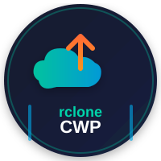

# rcloneCWP

<div align="center">



**Enterprise-grade backup & restore for CWP — powered by rclone**

[](https://opensource.org/licenses/MIT)
[](https://control-webpanel.com/)
[](https://rclone.org/)
[]()
[](https://github.com/fattain_naime/rcloneCWP)

</div>

---

## Overview

**rcloneCWP** is a **free, open-source** native module for [CWP (CentOS Web Panel)](https://control-webpanel.com/) that provides enterprise-grade backup and restore functionality using [rclone](https://rclone.org/) as the transport layer.

Matches [JetBackup5](https://www.jetbackup.com/) features at **zero cost** — with **70+ cloud destinations** instead of ~10.

---

## Logos

<div align="center">

| rcloneCWP | CWP Control Panel | rclone |
|:---:|:---:|:---:|
|  |  |  |
| **This module** | **Target panel** | **Cloud engine** |

</div>

---

## Key Differentiators

| Feature | JetBackup5 | rcloneCWP |
|---------|------------|-----------|
| **Cost** | $XX/month | **FREE** |
| **Destinations** | ~10 | **70+** |
| **Source Code** | Closed | **Open (MIT)** |
| **CWP Native** | Add-on | **Built-in** |
| **Custom Hooks** | Limited | **Full Shell/PHP/Python** |
| **API** | RESTful | **RESTful + CLI** |

---

## Supported Destinations

### Phase 1 (Core)
- ✅ Local
- ✅ FTP / SFTP
- ✅ Amazon S3
- ✅ Google Drive
- ✅ Google Cloud Storage
- ✅ Backblaze B2
- ✅ Wasabi
- ✅ Dropbox
- ✅ OneDrive

### Phase 2 (Extended)
- 🔜 Azure Blob
- 🔜 WebDAV

---

## Architecture

```
┌─────────────────────────────────────────────────────────────┐
│                    CWP Admin Panel                          │
│  ┌──────────────────────────────────────────────────────┐  │
│  │              rcloneCWP Module (PHP)                   │  │
│  │  ┌─────────┐ ┌──────────┐ ┌───────────┐ ┌────────┐  │  │
│  │  │Dashboard│ │Backup    │ │Restore    │ │Destin. │  │  │
│  │  │         │ │Jobs      │ │Manager    │ │Config  │  │  │
│  │  └─────────┘ └──────────┘ └───────────┘ └────────┘  │  │
│  │  ┌─────────┐ ┌──────────┐ ┌───────────┐ ┌────────┐  │  │
│  │  │Schedules│ │Hooks     │ │Logs       │ │API     │  │  │
│  │  │         │ │          │ │           │ │        │  │  │
│  │  └─────────┘ └──────────┘ └───────────┘ └────────┘  │  │
│  └──────────────────────────────────────────────────────┘  │
└─────────────────────────────────────────────────────────────┘
                              │
                              ▼
┌─────────────────────────────────────────────────────────────┐
│                    Core Engine (PHP)                         │
│  ┌─────────────┐ ┌──────────────┐ ┌──────────────────────┐ │
│  │ Backup      │ │ Restore      │ │ Scheduler            │ │
│  │ Engine      │ │ Engine       │ │ (Cron Manager)       │ │
│  └─────────────┘ └──────────────┘ └──────────────────────┘ │
│  ┌─────────────┐ ┌──────────────┐ ┌──────────────────────┐ │
│  │ Hook        │ │ Notification │ │ Encryption           │ │
│  │ System      │ │ System       │ │ Manager              │ │
│  └─────────────┘ └──────────────┘ └──────────────────────┘ │
└─────────────────────────────────────────────────────────────┘
                              │
                              ▼
┌─────────────────────────────────────────────────────────────┐
│                    rclone Binary                             │
│  ┌──────────────────────────────────────────────────────┐  │
│  │  rclone copy / move / sync / mount                   │  │
│  │  Config: /etc/rclone/rclone.conf                     │  │
│  │  VFS Cache: /var/cache/rclone/                       │  │
│  └──────────────────────────────────────────────────────┘  │
└─────────────────────────────────────────────────────────────┘
                              │
                              ▼
┌─────────────────────────────────────────────────────────────┐
│                    Cloud Destinations                        │
│  ┌──────┐ ┌──────┐ ┌──────┐ ┌──────┐ ┌──────┐ ┌──────┐   │
│  │S3    │ │GDrive│ │B2    │ │SFTP  │ │Dropbx│ │Azure │   │
│  └──────┘ └──────┘ └──────┘ └──────┘ └──────┘ └──────┘   │
└─────────────────────────────────────────────────────────────┘
```

---

## Features

### Backup Types
- **Full Backup** — Complete account snapshot
- **Incremental Backup** — Changed files only
- **Selective Backup** — User-selected components

### Components
- [x] Home directory files
- [x] MySQL/MariaDB databases
- [x] Email accounts
- [x] DNS zones
- [x] SSL certificates
- [x] Cron jobs
- [x] FTP accounts

### Restore Types
- [x] Full restore
- [x] Partial restore (per-component)
- [x] Cross-server restore (migration)

### Scheduling
- [x] Daily / Weekly / Monthly
- [x] Custom cron expressions
- [x] Interval-based (every N hours)
- [x] Retention policies (count/time-based)

### Security
- [x] AES-256-GCM encryption for credentials
- [x] Prepared statements (SQL injection prevention)
- [x] CSRF tokens on all forms
- [x] Input validation/sanitization
- [x] Command whitelisting for rclone
- [x] `escapeshellarg()` for all exec
- [x] File permissions 0600 for sensitive files
- [x] API rate limiting
- [x] IP whitelist support

### Hooks & Notifications
- [x] Pre/post backup hooks
- [x] Pre/post restore hooks
- [x] Shell/PHP/Python hook scripts
- [x] URL callbacks
- [x] Email notifications
- [x] Slack notifications
- [x] Telegram notifications

### API & CLI
- [x] RESTful API (17 endpoints)
- [x] CLI tools for automation
- [x] API key management
- [x] Rate limiting

---

## Database Schema

Tables are prefixed with `rclone_` to avoid CWP conflicts:

| Table | Purpose |
|-------|---------|
| `rclone_destinations` | Backup destination configs |
| `rclone_jobs` | Backup job definitions |
| `rclone_schedules` | Schedule definitions |
| `rclone_backups` | Backup history |
| `rclone_hooks` | Hook definitions |
| `rclone_logs` | Log entries |
| `rclone_api_keys` | API authentication |
| `rclone_notifications` | Notification configs |

---

## API Reference

### Authentication
```
Authorization: Bearer YOUR_API_KEY
```

### Endpoints

| Method | Endpoint | Description |
|--------|----------|-------------|
| GET | `/api/v1/destinations` | List destinations |
| POST | `/api/v1/destinations` | Create destination |
| GET | `/api/v1/destinations/{id}` | Get destination |
| PUT | `/api/v1/destinations/{id}` | Update destination |
| DELETE | `/api/v1/destinations/{id}` | Delete destination |
| POST | `/api/v1/destinations/{id}/test` | Test destination |
| GET | `/api/v1/jobs` | List backup jobs |
| POST | `/api/v1/jobs` | Create backup job |
| GET | `/api/v1/jobs/{id}` | Get backup job |
| PUT | `/api/v1/jobs/{id}` | Update backup job |
| DELETE | `/api/v1/jobs/{id}` | Delete backup job |
| POST | `/api/v1/jobs/{id}/run` | Run backup job now |
| GET | `/api/v1/backups` | List backups |
| GET | `/api/v1/backups/{id}` | Get backup details |
| DELETE | `/api/v1/backups/{id}` | Delete backup |
| POST | `/api/v1/backups/{id}/restore` | Restore from backup |
| GET | `/api/v1/schedules` | List schedules |
| POST | `/api/v1/schedules` | Create schedule |
| GET | `/api/v1/logs` | List logs |
| GET | `/api/v1/status` | System status |

---

## CLI Tools

```bash
# Backup management
rcloneCWP job list
rcloneCWP job run 1
rcloneCWP job show 1

# Restore
rcloneCWP restore 123 --user=builderh

# Destination management
rcloneCWP destination list
rcloneCWP destination test 1

# Schedule management
rcloneCWP schedule list

# Logs
rcloneCWP log view --lines=50

# Status
rcloneCWP status
```

---

## Installation

### One-liner
```bash
curl -sSL https://raw.githubusercontent.com/fattain_naime/rcloneCWP/main/install.sh | bash
```

### Manual
```bash
# Clone repository
cd /usr/local/cwpsrv/htdocs/resources/admin/modules/
git clone https://github.com/fattain_naime/rcloneCWP.git

# Set permissions
chown -R root:root rcloneCWP/
find rcloneCWP/ -type f -exec chmod 644 {} \;
find rcloneCWP/ -type d -exec chmod 755 {} \;
chmod 700 rcloneCWP/logs rcloneCWP/cache

# Run installer
php rcloneCWP/install.php

# Add menu entry
echo 'rcloneCWP|/index.php?module=rcloneCWP|fa fa-cloud|main' >> /usr/local/cwpsrv/htdocs/resources/admin/include/3rdparty.php

# Add cron entries
echo '*/5 * * * * root /usr/local/cwp/php71/bin/php /usr/local/cwpsrv/htdocs/resources/admin/modules/rcloneCWP/cron/rcloneCWP.php >> /var/log/rcloneCWP_cron.log 2>&1' >> /etc/crontab
echo '0 2 * * * root /usr/local/cwp/php71/bin/php /usr/local/cwpsrv/htdocs/resources/admin/modules/rcloneCWP/cron/rcloneCWP_cleanup.php >> /var/log/rcloneCWP_cleanup.log 2>&1' >> /etc/crontab

# Restart crond
systemctl restart crond
```

---

## Development Timeline

| Phase | Duration | Key Deliverable | Status |
|-------|----------|-----------------|--------|
| 1 | Days 1-5 | Foundation, DB, rclone wrapper | ⬜ |
| 2 | Days 6-10 | All destinations | ⬜ |
| 3 | Days 11-16 | Backup engine | ⬜ |
| 4 | Days 17-22 | Restore engine | ⬜ |
| 5 | Days 23-25 | Scheduling | ⬜ |
| 6 | Days 26-29 | Hooks & notifications | ⬜ |
| 7 | Days 30-34 | API & CLI | ⬜ |
| 8 | Days 35-38 | Dashboard & UI polish | ⬜ |
| 9 | Days 39-42 | Testing & QA | ⬜ |
| 10 | Days 43-45 | Release v1.0.0 | ⬜ |

---

## Documentation

| Document | Purpose |
|----------|---------|
| [RESEARCH-AND-BLUEPRINT.md](docs/RESEARCH-AND-BLUEPRINT.md) | Complete research, architecture, DB schema, security |
| [DEVELOPER-GUIDE.md](docs/DEVELOPER-GUIDE.md) | Coding standards, patterns, API reference |
| [IMPLEMENTATION-PLAN.md](docs/IMPLEMENTATION-PLAN.md) | 45-day development timeline |
| [sql/install.sql](sql/install.sql) | Database schema |

---

## Requirements

- **CWP Pro** (CentOS Web Panel)
- **rclone** >= 1.60
- **PHP** >= 7.1 (with CLI)
- **MySQL/MariaDB** >= 5.5
- **Root access**

---

## Contributing

Contributions are welcome! Please read our [Contributing Guide](CONTRIBUTING.md) first.

1. Fork the repository
2. Create a feature branch (`git checkout -b feature/amazing-feature`)
3. Commit your changes (`git commit -m 'Add amazing feature'`)
4. Push to the branch (`git push origin feature/amazing-feature`)
5. Open a Pull Request

---

## License

This project is licensed under the **MIT License** — see the [LICENSE](LICENSE) file for details.

---

## Credits

- **rclone** — [https://rclone.org/](https://rclone.org/) — The cloud sync engine
- **CWP Control Panel** — [https://control-webpanel.com/](https://control-webpanel.com/) — The hosting panel
- **JetBackup** — [https://www.jetbackup.com/](https://www.jetbackup.com/) — Feature reference

---

## Support

- 📧 **Email**: [your-email@example.com](mailto:your-email@example.com)
- 💬 **Issues**: [GitHub Issues](https://github.com/fattain_naime/rcloneCWP/issues)
- 📖 **Wiki**: [GitHub Wiki](https://github.com/fattain_naime/rcloneCWP/wiki)

---

<div align="center">

**rcloneCWP** — Free. Open-source. Enterprise-grade.

Made with ❤️ for the CWP community

</div>