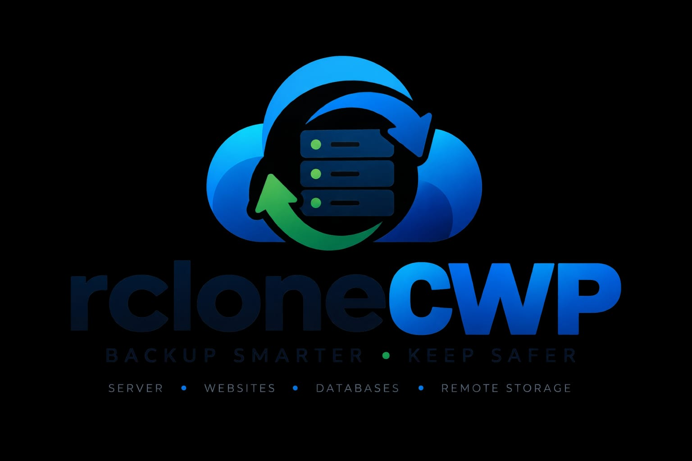

<p align="center">
  
</p>

# rcloneCWP

[](https://opensource.org/licenses/MIT)
[](https://www.php.net/)
[](https://rclone.org/)
[](http://centos-webpanel.com/)

> **Free, open-source native CWP module for enterprise-grade cloud backup and restore using rclone as the transport layer. JetBackup5-level features at zero cost.**

---

## Description

rcloneCWP is a native CentOS Web Panel (CWP) module that brings enterprise-grade cloud backup and restore capabilities to CWP servers. By leveraging rclone's battle-tested cloud synchronization engine (70+ providers), it provides JetBackup5-level functionality—including incremental backups, multi-destination scheduling, pre/post hooks, REST API, and CLI tooling—completely free and open-source under the MIT license.

The module integrates natively into CWP's admin panel, runs as root via CWP's PHP-FPM, and stores all runtime data (configs, encryption keys, logs) outside the web root for security.

---

## Features

| Feature | Description |
|---------|-------------|
| **12+ Cloud Providers** | AWS S3, Google Cloud Storage, Azure Blob, Backblaze B2, Wasabi, DigitalOcean Spaces, SFTP, FTP, WebDAV, Dropbox, Google Drive, OneDrive |
| **AES-256-GCM Encryption** | All destination credentials encrypted at rest; in-memory only during operations |
| **Full & Incremental Backups** | Rsync-style incremental with hard-link deduplication |
| **Flexible Scheduling** | Cron-based with retention policies (daily, weekly, monthly, custom) |
| **Pre/Post Hooks** | Shell, PHP, or Python scripts at job/backup/global level |
| **REST API** | Full CRUD for destinations, jobs, schedules, backups with API key auth |
| **CLI Toolkit** | `cli/rcloneCWP`, `cli/rclone-restore`, `cli/rclone-destination` for automation and CI/CD integration |
| **Cross-Server Restore** | Restore to different server with credential mapping |
| **Real-time Progress** | WebSocket-free polling progress bars in CWP UI |
| **Multi-language** | English & Bengali (extensible) |
| **Email/Telegram/Slack Notifications** | Configurable per job or global |

---

## Requirements

- **CWP** (CentOS Web Panel) Pro or free
- **PHP** 7.1+ (CWP's PHP binary at `/usr/local/cwp/php71/bin/php`)
- **rclone** 1.75.0+ (`/usr/bin/rclone` or `/usr/local/bin/rclone`)
- **MariaDB/MySQL** (uses CWP's `root_cwp` database)
- **Root access** for installation (module runs as root via CWP PHP-FPM)
- **AlmaLinux 8 / CentOS 7+** (tested on AlmaLinux 8.10)

---

## Installation

One-command install (run as root):

```bash
curl -sSL https://raw.githubusercontent.com/fattain_naive/rcloneCWP/main/install.sh | bash
```

The installer:
1. Creates the off-htdocs runtime home at `/usr/local/cwp/rcloneCWP/`
2. Installs the module to `/usr/local/cwpsrv/htdocs/resources/admin/modules/rcloneCWP.php`
3. Registers the menu entry in CWP's `3rdparty.php`
4. Creates the database schema (8 tables, prefixed `rclone_`)
5. Generates an AES-256-GCM encryption key at `/usr/local/cwp/rcloneCWP/key.bin`
6. Sets secure permissions (0600 configs, 0700 directories)

**Uninstall:**

```bash
cd /usr/local/cwp/rcloneCWP && php uninstall.php
```

---

## Quick Start

1. **Access the module** — Log into CWP admin (`https://your-server:2030`) and click **Rclone Backup** in the sidebar
2. **Add a destination** — Click *Destinations → Add New*, choose provider (e.g., S3), enter credentials, test connection, save
3. **Create a backup job** — Click *Jobs → Add New*, select destination, choose what to backup (files, databases, DNS, email), set retention
4. **Schedule it** — Click *Schedules → Add New*, link to your job, set cron expression (e.g., `0 2 * * *` for daily 2 AM), enable
5. **Monitor** — Dashboard shows last run, next run, status, and real-time progress during backup

---

## Supported Providers

| Provider | rclone Type | Notes |
|----------|-------------|-------|
| Amazon S3 | `s3` | All S3-compatible (Wasabi, MinIO, DigitalOcean Spaces, etc.) |
| Google Cloud Storage | `google cloud storage` | Service account JSON |
| Microsoft Azure Blob | `azureblob` | Account + key or SAS |
| Backblaze B2 | `b2` | Application key |
| Wasabi | `s3` | S3-compatible |
| DigitalOcean Spaces | `s3` | S3-compatible |
| SFTP | `sftp` | Key or password auth |
| FTP | `ftp` | Explicit/implicit TLS |
| WebDAV | `webdav` | Nextcloud, ownCloud, etc. |
| Dropbox | `dropbox` | OAuth2 |
| Google Drive | `drive` | OAuth2 / service account |
| OneDrive | `onedrive` | OAuth2 |

> Any rclone-supported backend works—configure via rclone's `rclone config` and reference the remote name.

---

## Architecture Overview

```
┌─────────────────────────────────────────────────────────────┐
│                    CWP Admin Panel (port 2030)              │
│  ┌─────────────────────────────────────────────────────┐   │
│  │              rcloneCWP Module (rcloneCWP.php)        │   │
│  │  ┌──────────┐ ┌──────────┐ ┌──────────┐ ┌────────┐  │   │
│  │  │Dashboard │ │Destinations│ │  Jobs   │ │Schedules│  │   │
│  │  └──────────┘ └──────────┘ └──────────┘ └────────┘  │   │
│  └─────────────────────────────────────────────────────┘   │
└─────────────────────────────────────────────────────────────┘
                              │
                              ▼
┌─────────────────────────────────────────────────────────────┐
│              Off-htdocs Runtime: /usr/local/cwp/rcloneCWP/  │
│  ┌──────────┐ ┌──────────┐ ┌──────────┐ ┌────────────────┐  │
│  │   lib/   │ │  sql/    │ │  logs/   │ │  key.bin (AES) │  │
│  └──────────┘ └──────────┘ └──────────┘ └────────────────┘  │
└─────────────────────────────────────────────────────────────┘
                              │
              ┌───────────────┼───────────────┐
              ▼               ▼               ▼
       ┌────────────┐ ┌────────────┐ ┌────────────┐
       │   rclone   │ │  Database  │ │   Cron     │
       │ (transport)│ │ (root_cwp) │ │ (system)   │
       └────────────┘ └────────────┘ └────────────┘
```

**Key design decisions:**
- **Off-htdocs placement**: All sensitive files (encryption key, configs, logs) live outside `/htdocs` at `/usr/local/cwp/rcloneCWP/`
- **In-memory credentials**: Decrypted destination secrets exist only in PHP memory during rclone execution—never written to disk or logged
- **Database isolation**: 8 tables prefixed `rclone_` in CWP's existing `root_cwp` database
- **Cron integration**: System crontab entries managed by the module, not CWP's backup cron

---

## API Reference

**Base URL:** `https://your-server:2030/index.php?module=rcloneCWP&api=1`

**Authentication:** Bearer token via `Authorization: Bearer <api_key>` header

| Endpoint | Method | Description |
|----------|--------|-------------|
| `/destinations` | GET/POST | List/create backup destinations |
| `/destinations/{id}` | GET/PUT/DELETE | Manage single destination |
| `/jobs` | GET/POST | List/create backup jobs |
| `/jobs/{id}` | GET/PUT/DELETE | Manage single job |
| `/jobs/{id}/run` | POST | Trigger immediate backup |
| `/schedules` | GET/POST | List/create schedules |
| `/schedules/{id}` | GET/PUT/DELETE | Manage schedule |
| `/backups` | GET | List backup history |
| `/backups/{id}` | GET | Backup details & logs |
| `/backups/{id}/restore` | POST | Initiate restore |
| `/hooks` | GET/POST | List/create hooks |
| `/notifications` | GET/POST | Notification configs |

**Response format:** `{ "success": bool, "data": ..., "error": {...} }`

---

## CLI Reference

```bash
# Run from module directory
cd /usr/local/cwp/rcloneCWP
php cli/rcloneCWP <command> [options]
```

| Command | Description |
|---------|-------------|
| `destination:list` | List all destinations |
| `destination:test <id>` | Test destination connectivity |
| `job:list` | List all jobs |
| `job:run <id>` | Execute backup job now |
| `job:status <id>` | Show last run status |
| `schedule:list` | List schedules |
| `schedule:enable <id>` / `disable <id>` | Toggle schedule |
| `backup:list` | List backup history |
| `backup:restore <id> [--target=server]` | Restore backup |
| `hook:test <id>` | Test hook execution |
| `config:show` | Show resolved configuration |
| `version` | Show module version |

---

## Security Model

- **Encryption at rest**: AES-256-GCM for all destination credentials (key in `/usr/local/cwp/rcloneCWP/key.bin`, 0600)
- **No credential leakage**: Secrets decrypted only in memory during rclone exec; redacted in all logs
- **Input validation**: All user input via `Validator.php` (whitelist + sanitization)
- **SQL injection prevention**: 100% prepared statements
- **XSS protection**: `htmlspecialchars()` on all output
- **CSRF tokens**: On every form in the UI
- **Command injection prevention**: `escapeshellarg()` on all `exec()`/`shell_exec()` calls
- **File permissions**: Configs 0600, directories 0700, owned by root
- **API authentication**: API keys with scoped permissions, rate limiting

---

## License

MIT License — see [LICENSE](LICENSE) for details.

Copyright (c) 2026 Fattain Naime

---

## Contributing

Contributions welcome! Please read [.github/CONTRIBUTING.md](.github/CONTRIBUTING.md) for:
- Code style (PSR-12 + project additions)
- Branch naming & commit conventions
- Testing requirements
- Pull request process

**Report issues:** [GitHub Issues](https://github.com/fattain_naive/rcloneCWP/issues)

**Discussions:** [GitHub Discussions](https://github.com/fattain_naive/rcloneCWP/discussions)

---

## Contributors

- **Fattain Naime** — Project creator & lead developer
- **Chayan Molla** — [Logo Design](https://www.facebook.com/share/1DZz91wJA3/)

---

## Links

- **GitHub**: https://github.com/fattain_naive/rcloneCWP
- **Documentation**: `/docs/` (see subdirectories for available docs)
- **Changelog**: [.github/CHANGELOG.md](.github/CHANGELOG.md)
- **Contributing**: [.github/CONTRIBUTING.md](.github/CONTRIBUTING.md)
- **CWP Module Path**: `/usr/local/cwpsrv/htdocs/resources/admin/modules/rcloneCWP.php`
- **Runtime Home**: `/usr/local/cwp/rcloneCWP/`