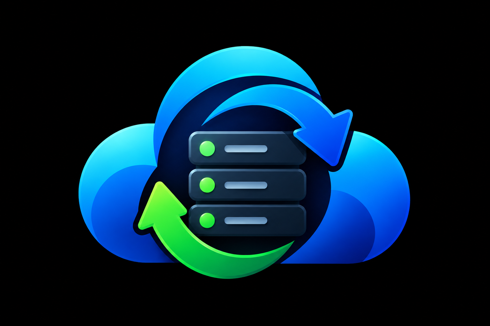

<p align="center">
  
</p>

<h1 align="center">rcloneCWP</h1>

<p align="center">
  Free, open-source native CWP module for enterprise-grade cloud backup and restore using rclone.
</p>

<p align="center">
  <a href="https://github.com/fattain-naime/rcloneCWP/blob/main/LICENSE"></a>
  <a href="https://www.php.net/"></a>
  <a href="https://rclone.org/"></a>
  <a href="https://github.com/fattain-naime/rcloneCWP/actions"></a>
</p>

---

JetBackup5-level features at zero cost. 12 cloud providers, AES-256-GCM encryption, automated scheduling, pre/post hooks, REST API, CLI tools, and a full dashboard UI.

## Documentation

| Document | Description |
|----------|-------------|
| [Installation Guide](docs/installation.md) | Requirements, one-command install, manual setup, uninstall |
| [Usage Guide](docs/usage.md) | Quick start, all dashboard tabs, CLI reference, API reference |
| [Troubleshooting](docs/troubleshooting.md) | Common issues, diagnostics, log inspection, error codes |
| [Changelog](.github/CHANGELOG.md) | Version history and release notes |
| [Contributing](.github/CONTRIBUTING.md) | Development setup, coding standards, PR guidelines |
| [Security Policy](.github/SECURITY.md) | Vulnerability reporting, security measures, scope |

## Features

| Feature | Description |
|---------|-------------|
| 12 Cloud Providers | S3, GCS, Azure, B2, SFTP, FTP, WebDAV, Dropbox, OneDrive, Swift, Tencent COS, Local |
| AES-256-GCM Encryption | All credentials encrypted at rest, decrypted only in memory during operations |
| Full and Incremental Backups | Rsync-style incremental with checksum tracking |
| Flexible Scheduling | Cron-based with retention policies (daily, weekly, monthly, custom) |
| Pre/Post Hooks | Shell, PHP, Python, or URL webhook scripts at any lifecycle event |
| REST API | Full CRUD for destinations, jobs, schedules, backups with API key auth |
| CLI Toolkit | rcloneCWP, rclone-restore, rclone-destination, rclone-schedule |
| Cross-Server Restore | Restore to different servers with credential mapping |
| Dashboard UI | Real-time status, recent backups, destination health, quick actions |
| Multi-Channel Notifications | Email (SMTP), Telegram Bot, Webhook (Slack/Discord/Generic) |

## Requirements

- **CWP** (CentOS Web Panel) - free or pro
- **PHP** 7.1+ (CWP PHP binary at `/usr/local/cwp/php71/bin/php`)
- **rclone** 1.75.0+ (`/usr/bin/rclone` or `/usr/local/bin/rclone`)
- **MariaDB/MySQL** (uses CWP's `root_cwp` database)
- **Root access** for installation

## Installation

One-command install (run as root):

```bash
curl -sSL https://raw.githubusercontent.com/fattain-naime/rcloneCWP/main/install.sh | bash
```

For manual installation and detailed instructions, see the [Installation Guide](docs/installation.md).

## Quick Start

1. **Access** - Log into CWP admin (`https://your-server:2030`) and click rcloneCWP in the sidebar
2. **Add destination** - Destinations tab, Add New, choose provider, enter credentials, test, save
3. **Create job** - Backup Jobs tab, select destination, choose components, set retention
4. **Schedule** - Schedules tab, link to job, set cron expression, enable
5. **Monitor** - Dashboard shows stats, recent backups, schedule overview

For detailed walkthrough of all features, see the [Usage Guide](docs/usage.md).

## Architecture

```
    +---------------------+     +---------------------+
    |   CWP Admin Panel   |     |   rcloneCWP Module  |
    |   (port 2030)       |     |   (rcloneCWP.php)   |
    +---------------------+     +---------------------+
                                          |
                    +---------------------+---------------------+
                    |                     |                     |
            +-------v-------+   +--------v--------+   +-------v-------+
            |   lib/        |   |   views/        |   |   api/        |
            |   (PHP Core)  |   |   (UI Templates)|   |   (REST API)  |
            +-------+-------+   +-----------------+   +---------------+
                    |
    +---------------+----------------+----------------+
    |               |                |                |
+---v---+   +------v------+  +-----v-----+  +------v------+
|Backup |   |Destinations |  | Scheduling|  | Notifications|
|Engine |   |  (12 types) |  |  (Cron)   |  | (Email/TG/  |
+---+---+   +------+------+  +-----+-----+  |  Webhook)   |
    |               |                |        +-------------+
    v               v                v
+--------+  +-----------+  +------------+
| rclone |  | MariaDB   |  | System     |
| binary |  | root_cwp  |  | crontab    |
+--------+  +-----------+  +------------+

Off-htdocs runtime: /usr/local/cwp/rcloneCWP/
  lib/     - Core PHP classes (Backup/, Destinations/, Restore/, Scheduling/)
  sql/     - Database schema (8 tables, rclone_ prefix)
  logs/    - Operation logs
  key.bin  - AES-256-GCM encryption key (mode 0600)
```

**Key design decisions:**

- **Off-htdocs placement** - All sensitive files (encryption key, configs, logs) live outside the web root
- **In-memory credentials** - Secrets exist only in PHP memory during rclone execution, never written to disk
- **Prepared statements** - 100% of database queries use parameterized queries
- **Output encoding** - All dynamic output escaped with htmlspecialchars() to prevent XSS

## API Reference

**Base URL:** `https://your-server:2030/index.php?module=rcloneCWP&api=1`

**Authentication:** Bearer token via `Authorization: Bearer <api_key>` header

| Endpoint | Method | Description |
|----------|--------|-------------|
| `/destinations` | GET/POST | List or create destinations |
| `/destinations/{id}` | GET/PUT/DELETE | Manage a destination |
| `/jobs` | GET/POST | List or create backup jobs |
| `/jobs/{id}` | GET/PUT/DELETE | Manage a backup job |
| `/jobs/{id}/run` | POST | Trigger immediate backup |
| `/schedules` | GET/POST | List or create schedules |
| `/backups` | GET | List backup history |
| `/backups/{id}/restore` | POST | Initiate restore |
| `/hooks` | GET/POST | List or create hooks |
| `/notifications` | GET/POST | Notification configs |

## CLI Reference

```bash
cd /usr/local/cwp/rcloneCWP

# Destination management
php cli/rclone-destination list
php cli/rclone-destination test <id>

# Backup jobs
php cli/rcloneCWP job list
php cli/rcloneCWP job run <id>

# Restore
php cli/rclone-restore <backup_id> --user=<username>

# Schedules
php cli/rclone-schedule list
```

For full CLI documentation, see the [Usage Guide](docs/usage.md).

## Security

rcloneCWP implements defense-in-depth security:

- **AES-256-GCM** encryption for all credentials at rest
- **In-memory credential passing** - zero plaintext on disk
- **Prepared statements** for all SQL queries
- **htmlspecialchars()** on all output to prevent XSS
- **CSRF tokens** on every form
- **escapeshellarg()** on all command execution
- **SSRF protection** for URL-type hooks and webhooks
- **File permissions** - 0600 for configs, 0700 for directories

See [Security Policy](.github/SECURITY.md) for vulnerability reporting.

## Supported Providers

| Provider | rclone Type | Auth Method |
|----------|-------------|-------------|
| Amazon S3 / Wasabi / MinIO | `s3` | Access key + secret |
| Google Cloud Storage | `google cloud storage` | Service account JSON |
| Azure Blob Storage | `azureblob` | Account + key |
| Backblaze B2 | `b2` | Application key |
| SFTP | `sftp` | Key or password |
| FTP | `ftp` | Username + password |
| WebDAV | `webdav` | Username + password |
| Dropbox | `dropbox` | OAuth2 |
| Google Drive | `drive` | OAuth2 |
| OneDrive | `onedrive` | OAuth2 |
| OpenStack Swift | `swift` | Username + API key |
| Tencent COS | `tencent` | Secret ID + key |
| Local Storage | `local` | Path + permissions |

Any rclone-supported backend can be configured via `rclone config`.

## Contributing

See [CONTRIBUTING.md](.github/CONTRIBUTING.md) for development setup, coding standards, and PR guidelines.

## Contributors

- **Fattain Naime** - Project creator and lead developer
- **Chayan Molla** - Logo design ([Profile](https://www.facebook.com/share/1DZz91wJA3/))

## License

MIT License - see [LICENSE](LICENSE) for details.

Copyright (c) 2026 Fattain Naime
